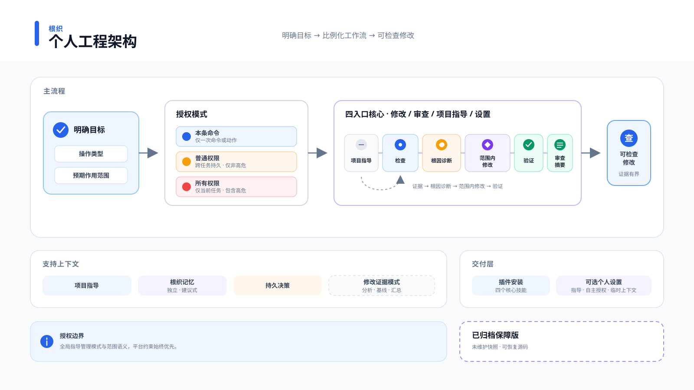

# 架构

Rootloom `main` 是四入口 Core。架构目标是个人每天使用的单代理工程闭环，
而不是企业审计与审批。



## 产品边界

```text
Rootloom Core
├── Change：Direct / Scoped / Governed / Evidence
├── Review
├── Project Guidance
├── Setup
├── Optional Autonomy：授权模式 / 命令 Rules
└── Optional Evidence Resources：Analyzer / Baseline / Contract / Seal / Finalizer

Rootloom Memory
└── 独立实验插件
```

拆分前的完整实现作为 **Archived Assurance Edition（已归档保障版）** 保留在
`codex/enterprise-assurance`。它是可恢复源码，不是持续维护的产品线。
详见 [Rootloom 4 Core Reset 决策](decisions/2026-07-29-rootloom-4-core-reset.md)
以及 [4.1 效率回环决策](decisions/2026-07-29-rootloom-4.1-efficiency-loop.md)。

## 所属路径

| 关注点 | 所属实现 |
| --- | --- |
| 全局任务策略与语义风险规则 | `plugins/rootloom/assets/system/AGENTS.md` |
| 静态风险与验证智能 | `plugins/rootloom/resources/evidence/runner/intelligence.py` |
| Direct、Scoped、Governed 与 Evidence 路由 | `plugins/rootloom/skills/operating-coding-change/` |
| 确定性 Evidence Helper 与两步编排 | `plugins/rootloom/resources/evidence/` |
| Governed Change 与持久决策记录 | `plugins/rootloom/skills/operating-coding-change/references/governed-change.md` |
| 仅审查工作流 | `plugins/rootloom/skills/operating-code-review/` |
| 独立项目/失败记忆插件 | `experiments/rootloom-memory/` |
| 确定性项目事实 | `plugins/rootloom/skills/project-guidance/scripts/seed_project_guidance.py` |
| 语义指导精炼 | `plugins/rootloom/skills/project-guidance/references/semantic-refinement.md` |
| Codex-home setup | `plugins/rootloom/skills/setup-rootloom/` |
| 生命周期 Hook 门禁 | `plugins/rootloom/hooks/run_component_hook.py` |

## Task Intelligence

风险判断依据影响，而不只是任务大小。`analyze_change.py` 检查任务文本、
预期/当前路径、Git 操作、有界 Tracked Patch 与仓库命令。Analyzer 输出具体信号、
检测/有效风险、最低 Tier、置信度与验证计划。Rootloom Core 永远不读取
`.project-memory/`。

路径上下文避免明显误判：单独的 `docs/auth.md` 或 auth 测试仍属于文档/测试范围，`src/auth/token.py` 等产品代码则会提高下限。持久状态、资金、认证/授权、并发、状态机、迁移、公共契约、基础设施、破坏性操作或跨越多个所属边界都会提高 Tier。人工风险声明只能提高、不能降低静态下限。

结果只是建议。语义判断继续由 Skills 和模型负责；消费者或影响未知时可以继续提高 Tier。确定性 Hook 不推断任务风险，扫描器也不授权任何操作。

## Engineering Workflow

`operating-coding-change` 拥有实现工作流。Direct 是有边界的快速路径：不加载
Reference，只检查精确目标并运行最小相关检查。脏工作树仍是保护约束，不会单独触发
模式升级；文件数量或局部 Callable/Signature 形态也不能证明公共契约存在。只有共享/
外部消费者、兼容义务或其他 Governed 风险信号成立时才进入 Governed。初始根因未知时
先在 Scoped 中做有限诊断；只有诊断后仍存在材料级不确定性才升级。Direct 与 Scoped
都由 Change Skill 自包含且不加载 Reference；Scoped 仍要求成比例的仓库证据、按行为
映射的验证以及一次检查后挑战，但不再增加一次模型/工具往返。Governed 加载兼容、
Rollout、Rollback 与详细验证规则；显式 Evidence Mode 才增加确定性采集。安装
Rootloom 永远不会启动 Analyzer 或 Finalizer。

缺陷的 `ROOT_CAUSE_ALIGNMENT: PASS` 必须包含触发方式、所属边界、被违反的不变量、有证据的根因以及对最强替代假设的否定。功能或机械任务使用 `NOT_APPLICABLE` 并明确目标不变量。

验证对应行为：主路径、所属边界不变量、相邻负向或替代路径。识别到对应风险时，还会要求 auth 边界、迁移共存、资金幂等、状态顺序、部署回滚或消费者兼容等检查。发现的 Make/test 命令只是建议；一个方便命令通过不等于验证完整，生成的计划也不会冒充已执行证据。

## 轻量产物辅助工具

`resources/evidence/finalize_change.py` 不使用 shell 执行操作方给定命令，并写入：

```text
run/
├── diff.patch
├── test.log
└── summary.json
```

`orchestrate_evidence.py prepare` 与 `finish` 是常见 Strict 生命周期的附加两命令
封装。`prepare` 创建 Intake，只替换精确生成的 Placeholder Draft 为结构化 Claim
Binding 并完成 Seal。`finish` 读取 Sealed Verification Command，调用现有 Strict
Finalizer，并要求显式确认已经完成语义审查。它不新增或重解释任何 Evidence Format；
底层 Intake、Seal 与 Finalizer CLI 仍拥有高级 Flag。Orchestrator 是单验证命令便捷
路径，不是异构 Governed Evidence 的默认入口；多 Target 或专用命令、迁移、
Mixed-version、安全边界及 Build + Runtime 证明使用底层生命周期。

只有明确要求严格 Tier 1/2 证据时，`begin_review.py` 才以事务方式创建仓库外 Intake，默认写入 `rootloom-change-baseline-v3`、可编辑的 `change-contract.draft.json` 与 `rootloom-review-run-v2`。Baseline v3 用 `intake-sealed` 描述本地 Intake 工作流事实；带历史 Wire Value 的 Baseline v2 继续可读、可 Seal。Intake-only 的 `--reviewable-path FILE` 可把精确文件密封为可审查，并具有独立固定的 64 项上限。声明先通过有界 Git Listing 规范到 Repository 的实际拼写，然后要求目标既有、Link Count 为一、非 Symlink、为常规文件，且 Worktree 变化不会被 Git Status/Diff 隐藏；它既能固定默认已可审查的环境模板或公共证书，也能降级公共 `.pem` 或 `.der` 等歧义材料。Ignored 路径、带 `assume-unchanged` / `skip-worktree` 标志的条目、Glob、大小写折叠歧义/重复、Hardlink、与显式 Sensitive Root 重叠及强秘密都会失败关闭。每次稳定 Capture 都会重复检查可见性、Index State、拼写、类型与 Link Count。声明仍然进入安全领域风险，并被纳入 Policy Hash，同时让本次 Intake 使用 `rootloom-change-baseline-v4`。

Baseline Reader 只按历史 v2/v3/v4 Wire Structure 与 Hash 验证，不再用最新分类器否定旧 Reviewable 声明。Finalizer 独立应用当前 64 项上限与材料策略；历史声明不兼容时，会在捕获 Reviewable 内容前返回 `reintake-required`。Summary 继续使用 Revision 5；`reviewability_policy` 通过实际校验链写入 `policy_provenance`，通过 `captured_files_provenance: final-capture-observed` 表达最终捕获来源，兼容字段 `source` 使用同一诚实值。除非显式允许全仓库范围，否则必须至少指定一个 Scope Path；默认要求干净 HEAD/Index，已有修改只能通过 `--allow-dirty-baseline` 显式纳入。发布使用平台的原子不可替换目录原语，因此不会覆盖并发创建的空目标目录。Draft 使用一个精确 Rootloom Placeholder，不再通过子串匹配误伤 Todo 业务文本。`seal_contract.py` 校验完成后的 Draft，再独占创建规范化 Final Contract 与 `rootloom-contract-seal-v1`。`--recover` 只会验证并补全精确的 Contract/Seal 中断发布，绝不覆盖不匹配证据。

版本化 Baseline 使用规范 UUID、Nonce、Hash 与 UTC Timestamp，并绑定 Repository Identity、HEAD、符号 HEAD Ref 与 Index。只有连续两次有界 Snapshot/Patch/Git Identity 采集完全一致，Repository Capture 才会被接受。Strict 会拒绝 Base 漂移，并在验证后重新校验证据字节、Seal、Git Base 与 Output Target。脏 Baseline 会记录既有修改；聚合 Tracked Patch 发生变化时，因为 v2/v3/v4 都不保存逐路径 Tracked Patch 字节，仍会把既有脏 Tracked 端点按保守范围归因；Untracked 项则可通过逐路径指纹/元数据把精确未变的既有状态分离出去。任务分区会在风险分析前计算，并同时供 Contract Scope 与 `diff.patch` 使用，因此精确未变的用户文本不会从其他消费者重新进入任务证据。既有脏路径若消失则视为 Gate Failure，因为它无法表示为当前任务 Patch。Strict JSON Decoder 会拒绝重复 Key、非有限或超范围数值。

秘密材料发现先使用共享的大小写不敏感 Git Pathspec 候选策略与用户声明的 Literal Root，再交给 `is_sensitive_material_path()`；不再枚举全部 Tracked/Ignored 路径。有意宽匹配的候选项使用独立有界上限，可配置的材料结果上限只在分类后执行；二者超限都会失败关闭。材料包括 `.env`、`.envrc`、非模板 `.env.<name>`、Credential 配置、Private Key/Keystore 格式、歧义 `.pem` 与 `.der`、显式 Root、常见 Key 命名的 PEM/DER 文件，以及 `clientSecret.json`、`apiToken.json`、`serviceAccountKey.json` 等 CamelCase 形式。`privkey.pem`、`privatekey.pem`、`rsa-key.pem`、`ec-key.pem`、`ecdsa-key.pem`、`ed25519-key.pem`、`encryption-key.pem`、`decryption-key.pem` 属于不可降级的强私钥名。环境模板（`.env.example`、`.env.sample`、`.env.template`、`.env.dist`）与公共证书格式（`.crt`、`.cer`、`.p7b`、`.p7c`）是安全领域路径：保留可审查 Patch，但提高风险。DER 可以编码私钥，因此默认只保留元数据；只有 Intake 对合格精确文件作 Reviewable 声明后才可审查。`.environment`、`.envelope` 与 `.envoy` 是普通路径。`src/auth/token.py` 等安全领域源码遵循相同的仅风险边界。秘密材料的常规文件、目录、Symlink、Tracked/Ignored/Untracked 项及 Rename 两端都不读取内容；Symlink Target 只做 Hash 绑定，不保存原值。在读取普通内容前，Capture 会比较完整发现的材料元数据集合与 Baseline 或验证前 Reference，包括 Git Status 遗漏的 Ignored 新增。任何 Reference Drift 或 Git 可观察的材料变化都会隔离所有变更端点，并停止额外仓库命令发现。被忽略的材料新增、修改和删除会合成为 Risk、Scope 与 Summary 共用的 Task Change。元数据包含身份、链接数、大小、权限、修改时间与变更时间，并明确标记为 `metadata-observed`，而非内容完整性。详见[材料分类与 Capture 决策](decisions/2026-07-15-sensitive-material-and-capture-bounds.md)。

`rootloom-change-contract-v1` 使用路径段感知的 Repository Glob（`*`/`?` 不跨段，`**` 才跨段），要求根因对齐，并把行为 Claim 映射到显式执行命令。只有来自 Sealed Contract 的结构化 Binding 能完成 Strict Claim Coverage；CLI Claim 只作诊断声明。Summary 保持 `rootloom-engineering-summary-v1`，升级到 `schema_revision: 5`，保留 `risk_assessment`，并分开一般声明、合格 Claim 与 `semantic_review`。`semantic_coverage: reviewed` 表达为 `operator-asserted`，不是机器证明；语义未知最高只能得到 `MECHANICALLY_VERIFIED`，未封存断言是 `SEMANTIC_REVIEW_ASSERTED`，Workflow-sealed 机械证据加该断言得到 `REVIEW_EVIDENCE_COMPLETE`。该状态表示证据链完成，不表示正确性已被证明。`evidence_complete` 是供自动化使用的稳定能力字段，`quality_status` 保留详细诊断枚举；Summary Provenance 用 `intake-sealed` 与 `workflow-sealed` 描述本地工作流事实，不表示身份保证。敏感遮蔽会把原本完整的审查限制为 `REVIEW_REQUIRED_WITH_REDACTIONS`、`evidence_complete: false` 与 `passed: false`。Strict 默认采用 Quality Exit，`--strict-bundle-only` 是显式非阻断形式；Advisory 仍保持按需和 Bundle 导向。详见[证据诚实的 Strict Review 决策](decisions/2026-07-15-evidence-honest-strict-review.md)。

所有命令字符串都会在第一条验证命令执行前完成解析。验证随后运行在受控本地 Process Group 或 Windows Job Object 中，并记录 `process_convergence` 与 `isolation: process-group-only`；无法分配 Job Object 时，Windows 会回退到 Parent/Pipe Observation 与系统进程树终止。Parent 退出后会先给异步 Windows Job Object 记账一个有界收敛宽限，再把剩余进程判定为泄漏后代。这不是执行不可信命令的沙箱，也不保证控制 Detached Service、容器、特权后台管理器、非敏感 Ignored 文件、Git 管理状态或外部状态。命令参数与输出会原样保存在本地 Bundle 中。

Status 与 Git Diff 在保留前即通过字节/路径上限流式捕获。每条 Git 命令也复用验证进程树控制器，并具有有限正数的逐命令时间预算、输出上限与后代清理。此外，每次稳定 Capture 的两轮采集共享同一个有限正数 `--max-capture-seconds` Monotonic Deadline（默认 90 秒）；每个 Git Child 取得剩余总时间与 `--max-git-seconds` 的较小值，有界 Python 循环也检查同一 Deadline。该上限分别约束验证前、验证后的稳定 Capture 生命周期；`capture_duration_seconds` 记录两者实际耗时之和。验证输出增量读取；超时、输出超限或残留子进程会终止受控 POSIX Process Group 或 Windows Job Object。证据和输出路径先对词法路径及父目录链执行无 Symlink 检查，再进行 Resolve 后的包含关系判断。Evidence 与 Output 必须同时位于 Repository Worktree 和解析后的 Git Common Directory 之外；Output 还必须不存在、为空或由 Rootloom 标记拥有。这样 Linked Worktree 的证据不会进入 Refs、Objects 或其他 Git 管理区。复用自有输出时，会先失效旧 Summary，避免新运行早退后留下过期权威结果。完整 Patch 默认上限为可配置的 16 MiB。秘密材料删除要求精确确认；安全源码删除只提高风险，不触发隐私确认。这仍是可变审查包，不是不可篡改审计记录。

Runner 辅助模块保持小型：

- `process.py`：有界子进程；
- `state.py`：有界 Git 状态、untracked 指纹与 patch；
- `baseline.py`：修改前敏感/状态生产者—消费者契约；
- `change_contract.py`：路径范围与验证 claim 门禁；
- `review_run.py`：Review Manifest 与 Contract Seal 的精确 Schema；
- `evidence_paths.py`：证据路径的词法无 Symlink 检查；
- `strict_json.py`：拒绝重复 Key 且只接受有限数值的 Evidence JSON Decoder；
- `verification.py`：命令解析与顺序检查；
- `intelligence.py`：建议式风险与验证规划；
- `contracts.py`：摘要/结果格式；
- `errors.py`：稳定本地失败。

## 独立 Project Memory

显式调用 `project-guidance` 可以把可复现事实写入托管 `AGENTS.md` 区块；
SessionStart Hook 绝不写入。Active Guidance 可以自动请求只读 Validate。没有当前
用户请求时，持久 Refine 必须由独立且精确的
`<!-- rootloom:refine-once version=1 -->` Marker 授权，只作用于该文件，并在成功
写入时消费；自然语言指导本身不能授权持久化。可选历史经验属于单独安装的 `rootloom-memory`
插件。它的 `$project-memory` Skill 只选择有界任务/路径匹配，
分离过期生命周期状态，所有结果都只是线索。

可选插件保留 `rootloom-project-memory-v1`、Legacy Entry 可读性、严格 No-follow
读取、有界 Collection、确定性 ID、显式加锁写入与原子替换。Rootloom Core 不导入
Memory Reader，Analyzer/Finalizer 也不暴露 Memory Flag。接受后的持久决策仍写入
仓库 Decision Record；Memory 的 Decision File 只作索引。

## Setup 与 Hook 边界

Codex 添加插件后安装即完成：Skills 可用，但全局指导、命令 Rules、Hook 策略与 setup 状态仍不存在。只有用户明确要求时，可选 Personal setup 才管理这些复制的全局资产。其 `install` 负责首次 setup；`upgrade` 保持已安装 capability，只有版本变化时不创建多余资产备份，资产变化时先备份，并安全退役已从新版目录移除且未漂移的目标。`status` 与 `upgrade` 都会校验已安装路径、对照已安装 Hash 并拒绝安装后漂移。兼容命令 `apply` 继续保留。setup 先计划、拒绝冲突、使用 create-exclusive 普通锁串行、逐目标原子写入。

复制后的全局指导负责语义授权：普通权限跨任务持久，覆盖每个明确目标的非高危步骤；本条命令与所有权限分别是单动作和当前任务的提升。静态命令规则无法携带这些上下文，因此可选 `autonomy` 总会包含 `global-policy`；命令规则只减少重复弹窗，并保留灾难性递归删除的硬拒绝。这是低确认授权模式，不是确定性命令安全系统。详见[分级授权决策](decisions/2026-07-14-tiered-authorization-modes.md)。

该设计不提供跨文件崩溃原子性、敌对同用户保护或恢复日志重放。中断造成的部分 apply 会通过 `status` 暴露，备份内容仍可检查。

唯一生命周期 Hook 是只读 `SessionStart` 项目 Context 检测。它要求托管组件策略包含精确整数 `version: 1`；策略缺失、损坏、类型错误、未来版本或符号链接都会关闭执行。它会跳过 Plan Session，并使用独立的增量 Renderer，把完整 Additional Context 限制在 4 KiB 内；目录地图、Module Candidate 与通用验证规则不会注入，验证命令也只在项目 Guidance 缺失时出现。扫描器继续保持确定性、有界、仅标准库、无网络与仓库内执行。持久指导是单独的显式 Skill 动作。

## 依赖与可移植性

运行时辅助工具只使用 Python 3.11+ 标准库。普通测试覆盖 Linux、macOS 与 Windows 兼容契约。可选 live smoke 需要已经安装并登录的 Codex CLI，只使用可丢弃 `CODEX_HOME`。
